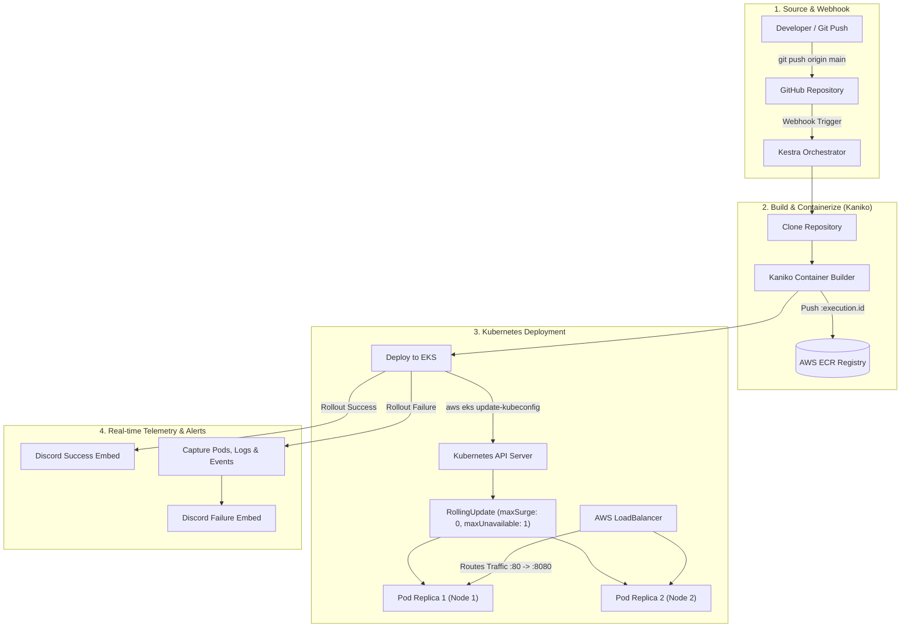

# eks-gitops-deploy: GitOps CI/CD on AWS EKS with Kestra

An automated GitOps deployment blueprint for packaging and deploying a containerized Spring Boot 3 application to **AWS Elastic Kubernetes Service (EKS)** with **Amazon ECR**, **Kaniko** (daemonless container builds), zero-downtime rolling updates, and real-time **Discord** telemetry alerts.

---

## Architecture Overview



### • Kestra Pipeline Execution Flow


---

## Configuration Reference

### 1. Workflow Inputs

These inputs are configured in [`kestra-workflow.yaml`](./kestra-workflow.yaml) and can be customized per execution:

| Input ID | Type | Default Value | Description | Required |
| :--- | :---: | :--- | :--- | :--- | :---: |
| `git_repo` | `STRING` | `https://github.com/<your-username>/eks-gitops-deploy.git` | Target Git repository containing the application code | Yes |
| `git_branch` | `STRING` | `main` | Git branch to clone and deploy | Yes |
| `aws_region` | `STRING` | `ap-south-2` | AWS Region where ECR and EKS are located | Yes |
| `ecr_registry` | `STRING` | `<your-account-id>.dkr.ecr.<region>.amazonaws.com` | Full AWS ECR registry host URL | Yes |
| `eks_cluster_name` | `STRING` | `eks-gitops-deploy-cluster` | Target AWS EKS cluster name | Yes |

---

### 2. Required Secrets / Key-Values

Set these secrets in your Kestra instance (**Namespace**: `prod.deployments` or global KV Store):

| Secret / KV Key | Description |
| :--- | :--- |
| `AWS_ACCESS_KEY_ID` | IAM access key with ECR push & EKS deployment permissions |
| `AWS_SECRET_ACCESS_KEY` | Corresponding IAM secret access key |
| `DISCORD_WEBHOOK_URL` | *(Optional)* Discord webhook URL for deployment notifications |

---

## Quick Start: Choose Your Deployment Mode

### • Mode A: Direct Deployment to Existing EKS & ECR (Skip IaC)

If you **already have an active AWS EKS cluster and ECR repository**, you can run the pipeline directly without touching Terraform:

1. **Import the Workflow into Kestra**:
   * Open Kestra UI (`http://localhost:8080`).
   * Navigate to **Flows** $\rightarrow$ Click **Create**.
   * Paste the contents of [`kestra-workflow.yaml`](./kestra-workflow.yaml) and click **Save**.
2. **Set Your Secrets**:
   * Navigate to **KV Store** / **Secrets** and add `AWS_ACCESS_KEY_ID`, `AWS_SECRET_ACCESS_KEY`, and `DISCORD_WEBHOOK_URL`.
3. **Execute the Flow**:
   * Click **Execute**. Provide your `ecr_registry` URL, `eks_cluster_name`, and `aws_region`.
   * Click **Run**. The pipeline will build, push, deploy, and verify your application on EKS.

---

### • Mode B: Full Infrastructure Provisioning with Terraform (IaC)

If you are provisioning a brand new AWS environment from scratch:

#### Step 1: Provision Infrastructure with Terraform
```bash
cd terraform

# 1. Initialize Terraform
terraform init

# 2. Review resources (VPC, Subnets, Internet Gateway, NAT, ECR, EKS Cluster, Node Groups)
terraform plan

# 3. Apply infrastructure
terraform apply -auto-approve
```

#### Step 2: Grab Generated Outputs
Upon completion, Terraform will output your exact cluster parameters:
```text
ecr_registry_host         = "<your-account-id>.dkr.ecr.<region>.amazonaws.com"
eks_cluster_name          = "eks-gitops-deploy-cluster"
kubectl_configure_command = "aws eks update-kubeconfig --region <region> --name eks-gitops-deploy-cluster"
```

#### Step 3: Run Kestra Pipeline
Import [`kestra-workflow.yaml`](./kestra-workflow.yaml) into Kestra with the Terraform outputs and trigger execution.

---

## Real-Time Webhook & GitOps Automation

To trigger the deployment automatically on every `git push`:

### Instant Terminal Trigger
```bash
curl -X POST \
  -H "Content-Type: application/json" \
  -d '{"event": "push", "ref": "refs/heads/main"}' \
  http://localhost:8080/api/v1/executions/webhook/prod.deployments/eks_gitops_deploy_pipeline/github-push-secret-key
```

### GitHub Webhook Setup
1. Go to your GitHub Repository $\rightarrow$ **Settings** $\rightarrow$ **Webhooks** $\rightarrow$ **Add webhook**.
2. **Payload URL**: `https://<YOUR-KESTRA-DOMAIN>/api/v1/executions/webhook/prod.deployments/eks_gitops_deploy_pipeline/github-push-secret-key`
3. **Content type**: `application/json`
4. **Events**: "Just the push event"

---

## Task-by-Task Workflow Breakdown

1. **`clone_repository`**: Clones the latest commit from GitHub into an isolated `WorkingDirectory`.
2. **`build_and_push_image` (Kaniko)**: Builds the container in userspace without requiring a privileged Docker daemon (`dind`), tagging the image with the unique immutable tag `:{{ execution.id }}` and pushing to AWS ECR.
3. **`deploy_and_verify_rollout`**:
   * Authenticates with AWS EKS using `aws eks update-kubeconfig`.
   * Injects the dynamic image tag into `k8s/deployment.yaml`.
   * Applies manifests (`kubectl apply -f k8s/`).
   * Tracks zero-downtime rolling update status with `kubectl rollout status --timeout=420s`.
   * Extracts the live Load Balancer URL, pod nodes, and replica counts, posting a rich notification to Discord.
4. **`errors` (Automated Failure Handler)**:
   * If any step fails, automatically captures `kubectl get pods`, container logs, and cluster events (`head -c 800`), sending an instant incident diagnostic report to Discord.

---

## Live Rollout & Telemetry Previews

### • Zero-Downtime Rolling Update Verification
During deployment, Kubernetes replaces pods sequentially (`maxSurge: 0, maxUnavailable: 1`) to preserve ENI IP capacity on EC2 worker nodes while maintaining 100% service uptime:


---

### • Discord Deployment Success Notification
Sent automatically when pods pass health checks and the rollout successfully completes:


---

### • Automated Incident & Diagnostics Notification
Sent automatically if any build, push, or rollout step encounters an issue with captured pod statuses and error logs:


---

## Application Endpoints & Telemetry Reference

Once deployed, the application exposes the following endpoints via the AWS LoadBalancer:

| HTTP Method | Endpoint | Description |
| :--- | :--- | :--- |
| `GET` | `/` | Service overview & route discovery map |
| `GET` | `/actuator/health` | Kubernetes health probes (Liveness & Readiness) |
| `GET` | `/api/hello` | Service connectivity check |
| `GET` | `/api/info` | Application metadata, author, and version |
| `GET` | `/api/system` | Live JVM memory telemetry, server uptime, and AWS EKS host details |
| `GET` | `/api/status` | Deployment status summary |

---

## Key Design Decisions

* **`maxSurge: 0, maxUnavailable: 1`**: Prevents IP exhaustion on AWS instances (`t3.micro` allows max 4 IPs per node) by replacing pods serially.
* **Kaniko for Builds**: Eliminates the need to mount `/var/run/docker.sock` or run root containers in CI/CD.
* **Multi-Stage Docker Build**: Compiles with Maven 3.9 + Java 17 and runs in a hardened JRE 17 Alpine container under an unprivileged `appuser:appgroup` user.
* **Concurrency Control**: `concurrency.behavior: QUEUE` guarantees that rapid Git pushes are processed sequentially without race conditions.

---

## Project Structure

```text
├── terraform/                           # Infrastructure as Code (AWS EKS, ECR, VPC)
│   ├── versions.tf                      # AWS Provider and version constraints
│   ├── variables.tf                     # Configurable cluster & network inputs
│   ├── vpc.tf                           # Multi-AZ VPC with Public & Private Subnets + NAT
│   ├── ecr.tf                           # Encrypted ECR repository + lifecycle policy
│   ├── eks.tf                           # EKS Control plane, Managed Node Group & Addons
│   ├── outputs.tf                       # Formatted outputs for Kestra inputs & CLI helpers
│   └── terraform.tfvars.example         # Example configuration file
├── src/
│   ├── main/java/com/kestra/blueprint/
│   │   ├── Application.java             # Spring Boot Application Entrypoint
│   │   └── controller/
│   │       ├── HomeController.java      # Root route discovery
│   │       └── AppController.java       # Hello, Info, System, and Status endpoints
│   └── main/resources/
│       └── application.yml              # Actuator & probe configurations
├── k8s/
│   ├── deployment.yaml                  # EKS Deployment with Liveness & Readiness Probes
│   └── service.yaml                     # Kubernetes LoadBalancer Service
├── Dockerfile                           # Multi-Stage Container Build (Non-root)
├── docker-compose.yaml                  # Local Kestra Orchestrator Service
├── kestra-workflow.yaml                 # Complete Kestra GitOps Workflow
└── pom.xml                              # Maven Configuration (Java 17, Spring Boot 3.3.4)
```

---

## Author

**Abhishek Khode**
* GitHub: [@Abhishekkhode](https://github.com/Abhishekkhode)
* Repository: [eks-gitops-deploy](https://github.com/Abhishekkhode/eks-gitops-deploy)
* LinkedIn : [Abhishek Khode](https://www.linkedin.com/in/abhishek-khode-1650372a0/)


