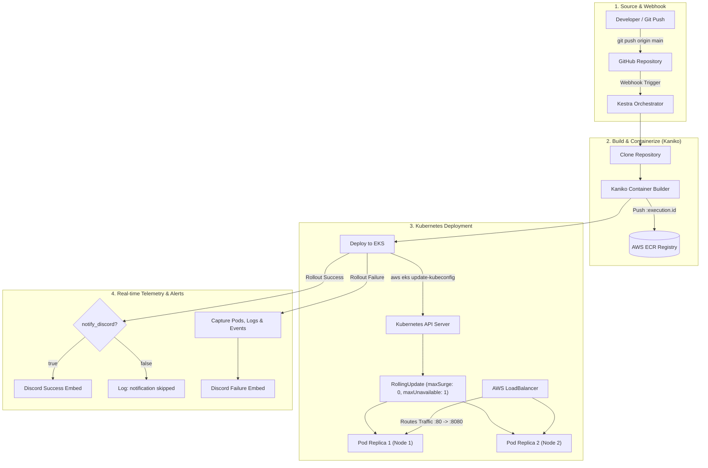
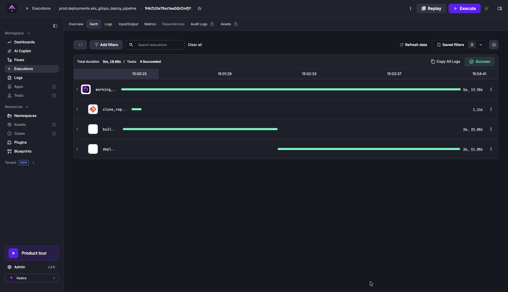
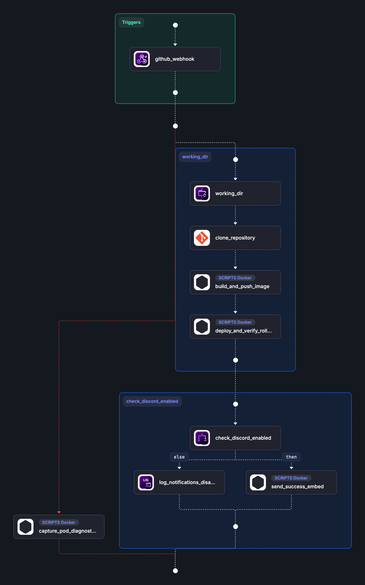
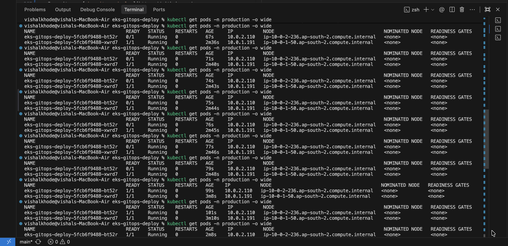
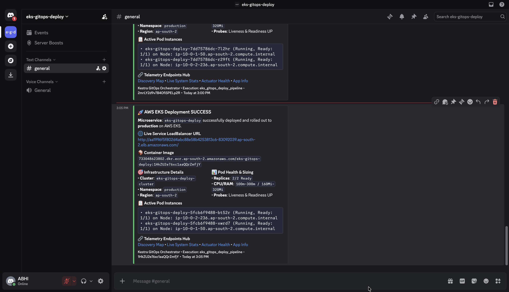
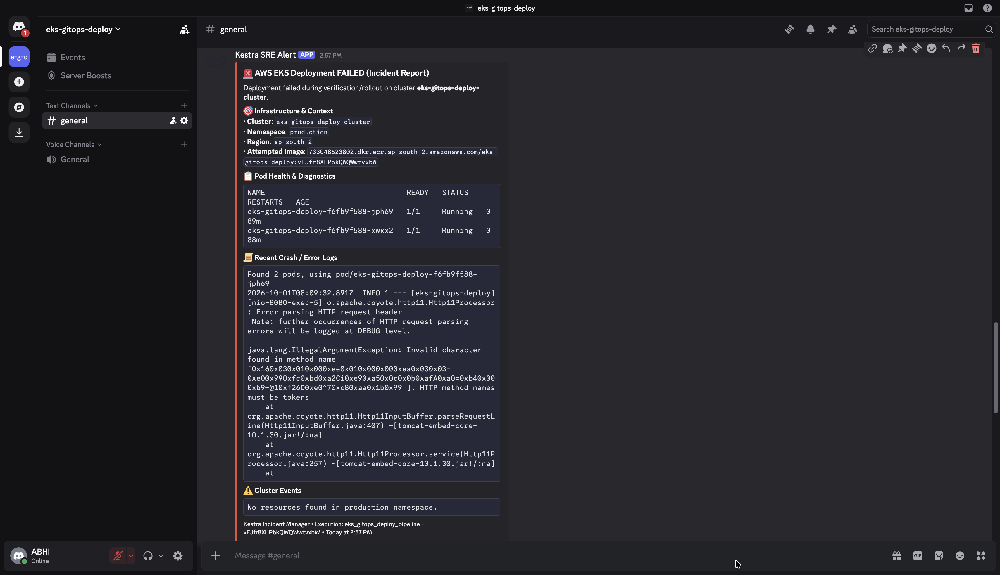

# eks-gitops-deploy: GitOps CI/CD on AWS EKS with Kestra

An automated GitOps deployment blueprint for packaging and deploying a containerized Spring Boot 3 application to **AWS Elastic Kubernetes Service (EKS)** with **Amazon ECR**, **Kaniko** (daemonless container builds), zero-downtime rolling updates, and real-time **Discord** telemetry alerts.

---

## Architecture Overview



### • Kestra Pipeline Execution Flow



### • Kestra Flow Graph

The topology view of the flow in Kestra. The webhook trigger starts the `working_dir` block (clone, Kaniko build and push, EKS deploy). The `check_discord_enabled` `If` task then either sends the success embed (`then`) or logs that notifications are disabled (`else`). The red path is the `errors` handler, which runs `capture_pod_diagnostics_and_alert` if any task fails.

<p align="center">
  
</p>

---

## Configuration Reference

### 1. Workflow Inputs

These inputs are configured in [`kestra-workflow.yaml`](./kestra-workflow.yaml) and can be customized per execution:

| Input ID | Type | Default Value | Description | Required |
| :--- | :---: | :--- | :--- | :---: |
| `git_repo` | `STRING` | `https://github.com/<your-username>/eks-gitops-deploy.git` | Target Git repository containing the application code | Yes |
| `git_branch` | `STRING` | `main` | Git branch to clone and deploy | Yes |
| `aws_region` | `STRING` | `ap-south-2` | AWS Region where ECR and EKS are located | Yes |
| `ecr_registry` | `STRING` | `<your-account-id>.dkr.ecr.<region>.amazonaws.com` | ECR registry **host only**, with no repository path. The flow appends `/eks-gitops-deploy:<execution id>` itself | Yes |
| `eks_cluster_name` | `STRING` | `eks-gitops-deploy-cluster` | Target AWS EKS cluster name | Yes |
| `k8s_namespace` | `STRING` | `production` | Kubernetes namespace to deploy into (created if missing; the `k8s/` manifests are rewritten to match) | No |
| `notify_discord` | `BOOL` | `true` | Post the success embed to Discord; set to `false` to skip it | No |

---

### 2. Required Secrets / Key-Values

Add these in your Kestra instance. Each one can be stored either as a **KV pair** (in the flow's namespace, `company.team`) or as a **Secret**. The flow looks in KV first and falls back to Secrets.

| Secret / KV Key | Required | Description |
| :--- | :---: | :--- |
| `AWS_ACCESS_KEY_ID` | Yes | IAM access key with ECR push & EKS deployment permissions |
| `AWS_SECRET_ACCESS_KEY` | Yes | Corresponding IAM secret access key |
| `DEPLOY_WEBHOOK_KEY` | Yes | Any random string you invent (for example `openssl rand -hex 16`). It is the last segment of the Kestra webhook URL, so only callers who know it can trigger a deployment. It is not an AWS or Discord credential |
| `DISCORD_WEBHOOK_URL` | If `notify_discord` is `true` | Discord channel webhook URL for deployment notifications |

The AWS region, registry, cluster name, repository, branch and Kubernetes namespace are flow **inputs**, not secrets.

---

## Quick Start: Choose Your Deployment Mode

### • Mode A: Direct Deployment to Existing EKS & ECR (Skip IaC)

If you **already have an active AWS EKS cluster and ECR repository**, you can run the pipeline directly without touching Terraform:

1. **Import the Workflow into Kestra**:
   * Open Kestra UI (`http://localhost:8080`).
   * Navigate to **Flows** $\rightarrow$ Click **Create**.
   * Paste the contents of [`kestra-workflow.yaml`](./kestra-workflow.yaml) and click **Save**.
   * The `extend:` block at the bottom is blueprint metadata (title, description, tags). The Kestra editor does not accept it as a flow property, so delete that block if the editor reports `Unrecognized field "extend"`.
2. **Set Your Secrets**:
   * Navigate to **KV Store** / **Secrets** and add `AWS_ACCESS_KEY_ID`, `AWS_SECRET_ACCESS_KEY`, `DEPLOY_WEBHOOK_KEY` and `DISCORD_WEBHOOK_URL`.
3. **Execute the Flow**:
   * Click **Execute**. Provide `git_repo`, `ecr_registry` (host only), `eks_cluster_name`, and `aws_region`. Optionally change `k8s_namespace` (default `production`) or set `notify_discord` to `false`.
   * Click **Run**. The pipeline will build, push, deploy, and verify your application on EKS.
4. **Check the Deployment** (refresh your local kubeconfig first if you recreated the cluster):
   ```bash
   aws eks update-kubeconfig --region <region> --name <cluster>
   kubectl get pods -n production
   ```

---

### • Mode B: Full Infrastructure Provisioning with Terraform (IaC)

If you are provisioning a brand new AWS environment from scratch:

#### Step 1: Provision Infrastructure with Terraform
The main module stores its state in S3, so create the state bucket first with the bootstrap module:
```bash
# 1. Create the remote-state S3 bucket
cd terraform/bootstrap
terraform init && terraform apply

# 2. Initialize the main module against that bucket (use the init_command output)
cd ..
terraform init -backend-config="bucket=<bucket-from-bootstrap-output>" -reconfigure

# 3. Review resources (VPC, Subnets, Internet Gateway, NAT, ECR, EKS Cluster, Node Groups)
terraform plan

# 4. Apply infrastructure
terraform apply -auto-approve
```

#### Step 2: Grab Generated Outputs
Upon completion, Terraform will output your exact cluster parameters:
```text
ecr_registry_host         = "<your-account-id>.dkr.ecr.<region>.amazonaws.com"
eks_cluster_name          = "eks-gitops-deploy-cluster"
kubectl_configure_command = "aws eks update-kubeconfig --region <region> --name eks-gitops-deploy-cluster"
```

#### Step 3: Run Kestra Pipeline
Import [`kestra-workflow.yaml`](./kestra-workflow.yaml) into Kestra, add the secrets from the table above, pass the Terraform outputs as inputs (`ecr_registry` is the host-only `ecr_registry_host` value), and trigger execution.

---

## Real-Time Webhook & GitOps Automation

The flow's Webhook trigger is protected by `DEPLOY_WEBHOOK_KEY`: the last segment of the URL must equal the value you stored, otherwise Kestra rejects the request. The key travels in the URL itself (it is not an HMAC signature), so keep it private and use HTTPS when Kestra is public.

To trigger the deployment automatically on every `git push`:

### Instant Terminal Trigger
```bash
curl -X POST \
  -H "Content-Type: application/json" \
  -d '{"event": "push", "ref": "refs/heads/main"}' \
  http://localhost:8080/api/v1/executions/webhook/company.team/eks-gitops-deploy-pipeline/<DEPLOY_WEBHOOK_KEY>
```

### GitHub Webhook Setup
1. Go to your GitHub Repository $\rightarrow$ **Settings** $\rightarrow$ **Webhooks** $\rightarrow$ **Add webhook**.
2. **Payload URL**: `https://<YOUR-KESTRA-DOMAIN>/api/v1/executions/webhook/company.team/eks-gitops-deploy-pipeline/<DEPLOY_WEBHOOK_KEY>`
3. **Content type**: `application/json`
4. **Events**: "Just the push event"
5. Leave GitHub's own **Secret** field empty; the key in the URL does that job.

> GitHub must be able to reach your Kestra URL, so a Kestra running on `localhost` needs a public tunnel or a server deployment. A webhook run passes no inputs, so it uses the input defaults.

---

## Task-by-Task Workflow Breakdown

1. **`clone_repository`**: Clones the latest commit from GitHub into an isolated `WorkingDirectory`.
2. **`build_and_push_image` (Kaniko)**: Builds the container in userspace without requiring a privileged Docker daemon (`dind`), tagging the image with the unique immutable tag `:{{ execution.id }}` and pushing to AWS ECR.
3. **`deploy_and_verify_rollout`**:
   * Authenticates with AWS EKS using `aws eks update-kubeconfig`.
   * Creates the target namespace (`k8s_namespace`) if needed.
   * Injects the dynamic image tag and the namespace into the `k8s/` manifests.
   * Applies manifests (`kubectl apply -f k8s/`).
   * Tracks zero-downtime rolling update status with `kubectl rollout status --timeout=420s`.
   * Extracts the live Load Balancer URL, pod nodes, and replica counts, and writes the Discord success embed to `discord_success.json` (an output file).
4. **`check_discord_enabled` (`If`)**: Branches on the `notify_discord` input. When `true`, `send_success_embed` posts the embed to Discord; when `false`, `log_notifications_disabled` records that the notification was skipped.
5. **`errors` (Automated Failure Handler)**:
   * If any step fails, automatically captures `kubectl get pods`, container logs, and cluster events (`head -c 800`), sending an instant incident diagnostic report to Discord.

---

## Live Rollout & Telemetry Previews

### • Zero-Downtime Rolling Update Verification
During deployment, Kubernetes replaces pods sequentially (`maxSurge: 0, maxUnavailable: 1`) to preserve ENI IP capacity on EC2 worker nodes while maintaining 100% service uptime:



---

### • Discord Deployment Success Notification
Sent automatically when pods pass health checks and the rollout successfully completes:



---

### • Automated Incident & Diagnostics Notification
Sent automatically if any build, push, or rollout step encounters an issue with captured pod statuses and error logs:



---

## Application Endpoints & Telemetry Reference

Once deployed, the application exposes the following endpoints via the AWS LoadBalancer:

| HTTP Method | Endpoint | Description |
| :--- | :--- | :--- |
| `GET` | `/` | Service overview & route discovery map |
| `GET` | `/actuator/health` | Kubernetes health probes (Liveness & Readiness) |
| `GET` | `/api/hello` | Service connectivity check |
| `GET` | `/api/info` | Application metadata, author, and version |
| `GET` | `/api/system` | Live JVM memory telemetry, server uptime, and AWS EKS host details |
| `GET` | `/api/status` | Deployment status summary |

---

## Key Design Decisions

* **`maxSurge: 0, maxUnavailable: 1`**: Prevents IP exhaustion on AWS instances (`t3.micro` allows max 4 IPs per node) by replacing pods serially.
* **Kaniko for Builds**: Eliminates the need to mount `/var/run/docker.sock` or run root containers in CI/CD.
* **Multi-Stage Docker Build**: Compiles with Maven 3.9 + Java 17 and runs in a hardened JRE 17 Alpine container under an unprivileged `appuser:appgroup` user.
* **Configurable, not hardcoded**: Region, registry, cluster, repository, branch and Kubernetes namespace are inputs, and the webhook key is a stored value rather than a string in the repository.
* **`If` task for notifications**: Discord posting is its own optional step, so the flow also works for teams without a Discord webhook. The embed is handed over as an output file because an `If` cannot live inside a `WorkingDirectory`.
* **Concurrency Control**: `concurrency.behavior: QUEUE` guarantees that rapid Git pushes are processed sequentially without race conditions.

---

## Project Structure

```text
├── terraform/                           # Infrastructure as Code (AWS EKS, ECR, VPC)
│   ├── backend.tf                       # S3 remote state backend
│   ├── versions.tf                      # AWS Provider and version constraints
│   ├── variables.tf                     # Configurable cluster & network inputs
│   ├── vpc.tf                           # Multi-AZ VPC with Public & Private Subnets + NAT
│   ├── ecr.tf                           # Encrypted ECR repository + lifecycle policy
│   ├── eks.tf                           # EKS Control plane, Managed Node Group & Addons
│   ├── outputs.tf                       # Formatted outputs for Kestra inputs & CLI helpers
│   ├── terraform.tfvars.example         # Example configuration file
│   └── bootstrap/                       # Creates the S3 bucket used for remote state
├── src/
│   ├── main/java/com/kestra/blueprint/
│   │   ├── Application.java             # Spring Boot Application Entrypoint
│   │   └── controller/
│   │       ├── HomeController.java      # Root route discovery
│   │       └── AppController.java       # Hello, Info, System, and Status endpoints
│   └── main/resources/
│       └── application.yml              # Actuator & probe configurations
├── k8s/
│   ├── deployment.yaml                  # EKS Deployment with Liveness & Readiness Probes
│   └── service.yaml                     # Kubernetes LoadBalancer Service
├── Dockerfile                           # Multi-Stage Container Build (Non-root)
├── docker-compose.yaml                  # Local Kestra Orchestrator Service
├── kestra-workflow.yaml                 # Kestra GitOps blueprint (flow + blueprint metadata)
└── pom.xml                              # Maven Configuration (Java 17, Spring Boot 3.3.4)
```

---

## Author

**Abhishek Khode**
* GitHub: [@Abhishekkhode](https://github.com/Abhishekkhode)
* Merged PR: [PR #295](https://github.com/kestra-io/blueprints/pull/295)
* Repository: [eks-gitops-deploy](https://github.com/Abhishekkhode/eks-gitops-deploy)
* LinkedIn : [Abhishek Khode](https://www.linkedin.com/in/abhishek-khode-1650372a0/)
* Kestra : [AWS EKS GitOps Deploy](https://kestra.io/blueprints/aws-eks-gitops-deploy)


